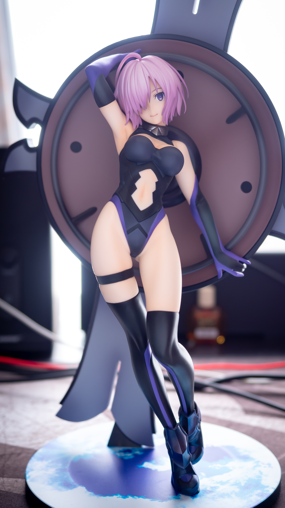
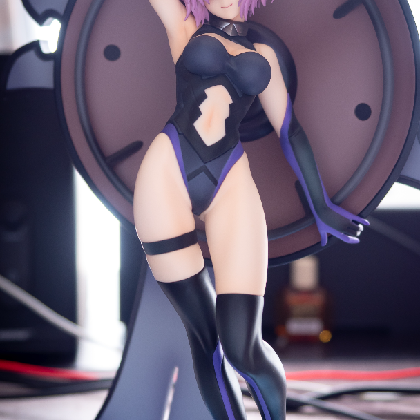
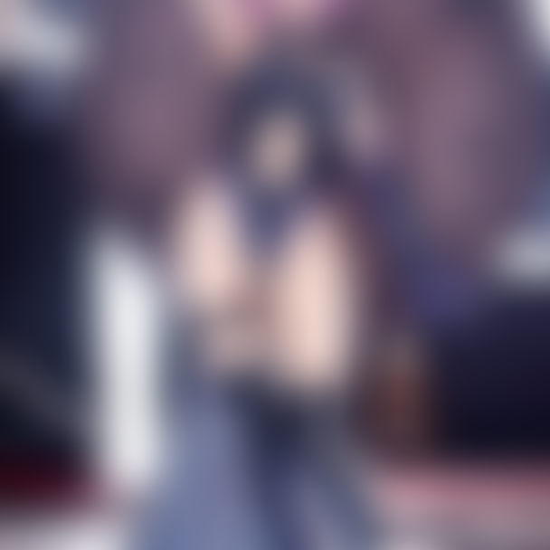
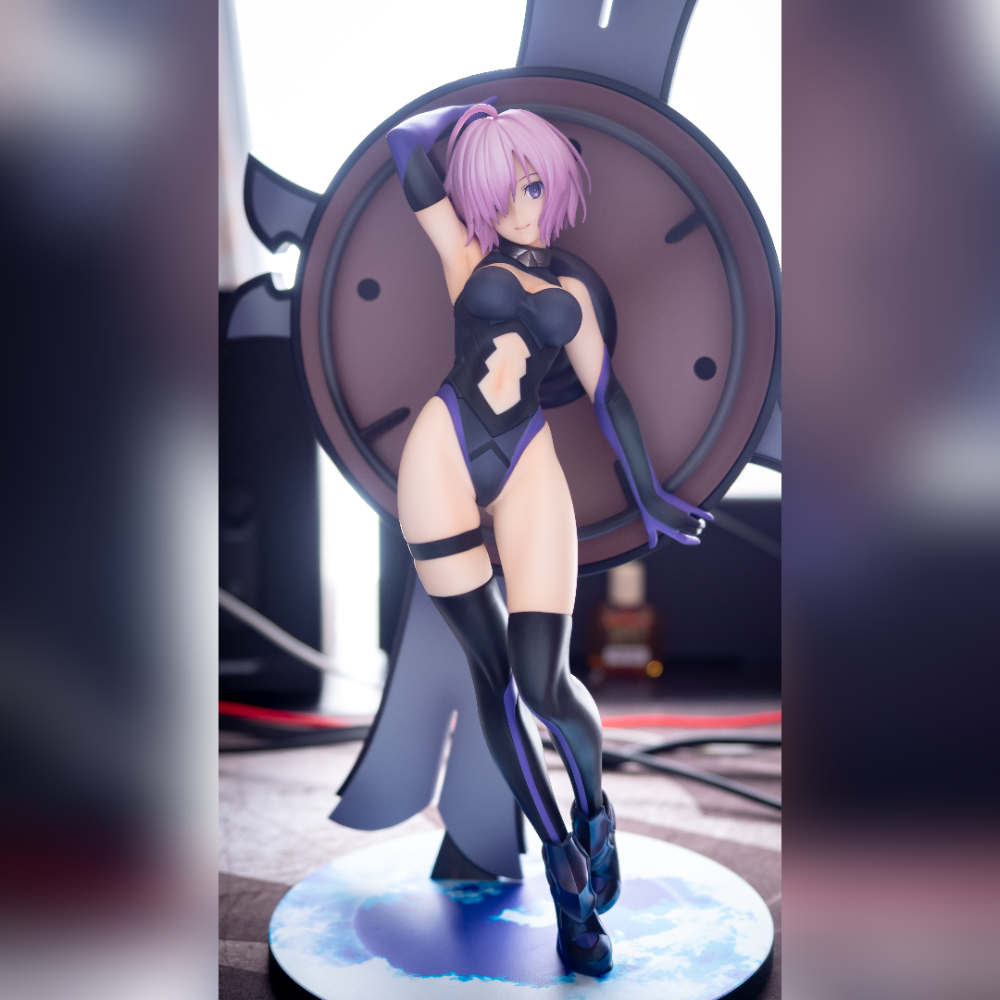

# canvas-rectangle-to-square-image

Generate square image from rectangle image by canvas(webgl).
It's useful for posting to instagram!!

Techs:

- [Vite](https://vitejs.dev/)
- [React](https://reactjs.org/)
- [Tailwind CSS](https://tailwindcss.com/)

## processing step

### step0: input image

### step1: make square image

### step2: blur image

### step3: composite blurred image and original image

## Credits

| item (description) | author       | URL                                |
| :----------------: | :----------- | :--------------------------------- |
|      glfx.js       | Evan Wallace | <https://evanw.github.io/glfx.js/> |
